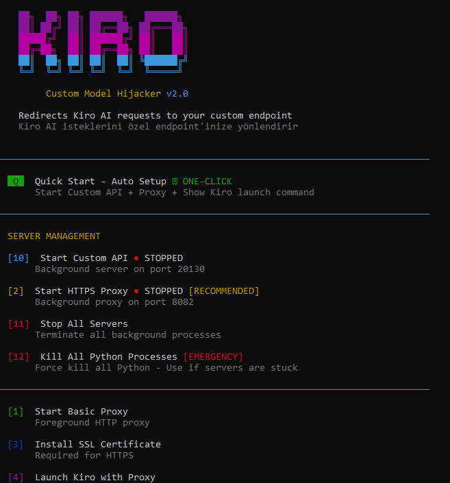
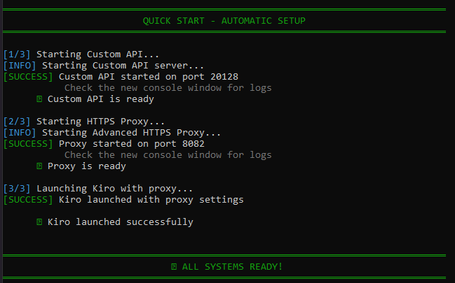

# 🚀 Kiro - Custom Model - Hijacker v2.0

<div align="center">


**Kiro AI isteklerini özel endpoint'inize yönlendirin - MCP Server'a alternatif çözüm**

*Redirects Kiro AI requests to your custom endpoint - Alternative to MCP Server*

[🚀 Hızlı Başlangıç](#-hızlı-başlangıç) • [🌟 Özellikler](#-özellikler) • [🆚 MCP vs Hijacker](#-mcp-server-vs-kiro-hijacker) • [📦 Kurulum](#-kurulum) • [🎯 Kullanım](#-kullanım) • [🔧 Teknik Detaylar](#-teknik-detaylar) • [⚠️ Uyarılar](#️-önemli-uyarilar) • [🔗 İlgili Projeler](#-i̇lgili-projeler)

</div>

---

## 📑 İçindekiler

- [Video Tanıtım](#-video-tanıtım)
- [Neden Bu Proje?](#-neden-bu-proje)
- [Hızlı Başlangıç](#-hızlı-başlangıç)
  - [Yöntem 1: Kendi Endpoint'inizi Kullanın](#yöntem-1-kendi-endpointinizi-kullanın)
  - [Yöntem 2: 9Router ile Multi-Provider](#yöntem-2-9router-ile-multi-provider-kullanın)
  - [Yöntem 3: Manuel Kurulum](#yöntem-3-manuel-kurulum-i̇leri-seviye)
- [MCP Server vs Kiro Hijacker](#-mcp-server-vs-kiro-hijacker)
- [Proje Hakkında](#-proje-hakkında)
- [Özellikler](#-özellikler)
- [Kurulum](#-kurulum)
- [Kullanım](#-kullanım)
- [Teknik Detaylar](#-teknik-detaylar)
- [Ekran Görüntüleri](#-ekran-görüntüleri)
- [Sorun Giderme](#-sorun-giderme)
- [Önemli Uyarılar](#️-önemli-uyarilar)
- [İlgili Projeler](#-i̇lgili-projeler)
- [Katkıda Bulunun](#-katkıda-bulunun)
- [Lisans](#-lisans)
- [İletişim](#-i̇letişim)

---

## 🎥 Video Tanıtım

<div align="center">

[](https://youtu.be/9FiGQl005uo)

**[▶️ YouTube'da İzle: Kiro AI'ı Hackledim! Kendi AI Modelimi Kullanıyorum](https://youtu.be/9FiGQl005uo)**

*Projenin kurulumu ve kullanımını detaylı anlatan video rehber*

</div>

---

## 🎯 Neden Bu Proje?

**Kiro, GitHub Copilot altyapısını kullanıyor!** İşte detaylar:

- **API Endpoint**: `https://api.github.com/copilot_internal/user`
- **Provider**: GitHub Copilot'un internal API'si
- **Modeller**: Claude, GPT vb. GitHub'ın sunucularında çalışıyor
- **Kiro**: Sadece bir frontend/UI
- **Gereksinim**: GitHub Copilot aboneliği

Bu nedenle **Kiro ve birçok IDE, model seçimi yaptırmıyor** - kendi servislerini kullanıyorlar.

### 💡 Çözümler

1. **MCP Server** (Kiro > MCP Servers): API'lerinizi MCP protokolü ile entegre edin
2. **Bu Proje** (Kiro Hijacker): Network seviyesinde tüm istekleri yakalayıp yönlendirin

---

## 🚀 Hızlı Başlangıç

### Yöntem 1: Kendi Endpoint'inizi Kullanın

Kendi API endpoint'iniz varsa (OpenAI uyumlu):

#### Adım 1: Projeyi İndirin
```bash
git clone https://github.com/gkhantylnl/kiro-custom-model-hijacker.git
cd kiro-custom-model-hijacker
```

#### Adım 2: Config Dosyasını Oluşturun
```bash
# Windows
copy config.example.py config.py

# Linux/Mac
cp config.example.py config.py
```

#### Adım 3: API Bilgilerinizi Girin

`config.py` dosyasını açın ve kendi bilgilerinizi yazın:

```python
# API Yapılandırması
API_ENDPOINT = "http://localhost:20128/v1"  # Kendi endpoint'iniz
API_KEY = "sk-your-api-key-here"            # API anahtarınız
MODEL_NAME = "gpt-4"                        # Model adınız
```

#### Adım 4: Bağımlılıkları Yükleyin
```bash
pip install -r requirements.txt
```

#### Adım 5: Quick Start ile Başlatın
```bash
# Windows
start.bat

# veya doğrudan
python menu_v2.py
```

Menüden **[Q] Quick Start** seçeneğini seçin - otomatik olarak her şeyi başlatır! 🎉

---

### Yöntem 2: 9Router ile Multi-Provider Kullanın

[9Router](https://github.com/gkhantyln/9router), birden fazla AI provider'ı tek bir endpoint'te toplamanızı sağlar.

#### 9Router'ın Avantajları

- ✅ **Multi-Provider**: Birden fazla AI sağlayıcısını tek yerden yönetin
- ✅ **Ücretsiz + Ücretli**: Hem ücretsiz hem ücretli API'leri destekler
- ✅ **Load Balancing**: Otomatik yük dengeleme
- ✅ **Fallback**: Bir API çalışmazsa diğerine geçer
- ✅ **OpenAI Uyumlu**: Standart OpenAI API formatı

#### 9Router Kurulumu

1. **9Router'ı İndirin ve Kurun**
```bash
git clone https://github.com/gkhantyln/9router.git
cd 9router
pip install -r requirements.txt
```

2. **9Router'ı Yapılandırın**

`9router/config.json` dosyasını düzenleyin:

```json
{
  "providers": [
    {
      "name": "openai",
      "endpoint": "https://api.openai.com/v1",
      "api_key": "sk-your-openai-key",
      "models": ["gpt-4", "gpt-3.5-turbo"],
      "priority": 1
    },
    {
      "name": "anthropic",
      "endpoint": "https://api.anthropic.com/v1",
      "api_key": "sk-ant-your-key",
      "models": ["claude-3-opus", "claude-3-sonnet"],
      "priority": 2
    },
    {
      "name": "free-provider",
      "endpoint": "https://free-api.example.com/v1",
      "api_key": "free-key",
      "models": ["llama-2", "mistral"],
      "priority": 3
    }
  ],
  "port": 20128,
  "load_balancing": true,
  "fallback": true
}
```

3. **9Router'ı Başlatın**
```bash
python router.py
```

4. **Kiro Hijacker'ı Yapılandırın**

`config.py` dosyasını 9Router'a yönlendirin:

```python
# API Yapılandırması
API_ENDPOINT = "http://localhost:20128/v1"  # 9Router endpoint'i
API_KEY = "any-key"                         # 9Router kendi key'leri kullanır
MODEL_NAME = "auto"                         # 9Router otomatik seçer
```

5. **Kiro Hijacker'ı Başlatın**
```bash
python menu_v2.py
```

Menüden **[Q] Quick Start** seçin!

**Artık Kiro, 9Router üzerinden tüm AI provider'larınızı kullanabilir!** 🚀

---

### Yöntem 3: Manuel Kurulum (İleri Seviye)

Adım adım manuel kurulum için:

1. Bağımlılıkları yükleyin: `pip install -r requirements.txt`
2. Config dosyasını oluşturun: `copy config.example.py config.py`
3. SSL sertifikası kurun: Menüden **[3] Install SSL Certificate**
4. Custom API başlatın: `python custom_api.py`
5. Proxy başlatın: `python advanced_proxy.py`
6. Kiro'yu başlatın:

```powershell
$env:HTTPS_PROXY="http://localhost:8080"
$env:HTTP_PROXY="http://localhost:8080"
$env:NODE_TLS_REJECT_UNAUTHORIZED="0"
& "C:\Users\KULLANICI_ADINIZ\AppData\Local\Programs\Kiro\Kiro.exe"
```

---

## � MCP Server vs Kiro Hijacker

### MCP Server Nedir?

**MCP (Model Context Protocol)**, Kiro'nun resmi olarak desteklediği bir protokoldür. API'lerinizi MCP formatında paketleyip Kiro'ya entegre edebilirsiniz.

**MCP Server Özellikleri:**
- ✅ Resmi Kiro desteği
- ✅ IDE içinde görünür (MCP Servers menüsü)
- ✅ Tool/Function calling desteği
- ✅ Güvenli ve stabil
- ❌ MCP protokolü öğrenme gereksinimi
- ❌ Her API için ayrı MCP server yazma
- ❌ Sadece tool calling, chat değil

### Kiro Hijacker Nedir?

**Kiro Hijacker**, network seviyesinde çalışan bir proxy sistemidir. Kiro'nun tüm AI isteklerini yakalar ve kendi endpoint'inize yönlendirir.

**Kiro Hijacker Özellikleri:**
- ✅ **Tam kontrol**: Tüm AI chat isteklerini yakalar
- ✅ **Kolay kurulum**: Sadece config.py düzenleyin
- ✅ **Multi-provider**: 9Router ile birden fazla AI sağlayıcısı
- ✅ **OpenAI uyumlu**: Standart API formatı
- ✅ **Transparent**: Kiro hiçbir şeyden haberdar değil
- ✅ **Debugging**: Tüm istekleri görebilirsiniz
- ❌ Network proxy gerektirir
- ❌ SSL sertifika kurulumu

### Karşılaştırma Tablosu

| Özellik | MCP Server | Kiro Hijacker |
|---------|-----------|---------------|
| **Kurulum Kolaylığı** | Orta (MCP öğrenme) | Kolay (config.py) |
| **AI Chat Desteği** | ❌ Hayır | ✅ Evet |
| **Tool Calling** | ✅ Evet | ❌ Hayır |
| **Multi-Provider** | ❌ Her biri ayrı | ✅ 9Router ile |
| **Debugging** | Zor | ✅ Kolay (loglar) |
| **Kiro Güncellemeleri** | ✅ Etkilenmez | ⚠️ Değişebilir |
| **Güvenlik** | ✅ Yüksek | ⚠️ Orta (SSL) |
| **Kullanım Senaryosu** | Tool/Function | AI Chat |

### Hangisini Seçmeliyim?

**MCP Server kullanın eğer:**
- Kiro'ya özel tool'lar eklemek istiyorsanız
- Function calling yapmanız gerekiyorsa
- Resmi destek istiyorsanız
- Uzun vadeli stabilite önemliyse

**Kiro Hijacker kullanın eğer:**
- AI chat modellerini değiştirmek istiyorsanız
- Birden fazla AI provider kullanmak istiyorsanız (9Router)
- Tüm istekleri debug etmek istiyorsanız
- Hızlı prototipleme yapıyorsanız
- Ücretsiz + ücretli API'leri karıştırmak istiyorsanız

**İkisini birlikte kullanın!**
- MCP Server: Tool calling için
- Kiro Hijacker: AI chat için

---

## 🎯 Proje Hakkında

**Kiro Custom Model Hijacker**, Kiro AI IDE'nin API isteklerini yakalayıp kendi özel AI modelinize veya endpoint'inize yönlendirmenizi sağlayan eğitim amaçlı bir araçtır.

### 🔧 Nasıl Çalışır?

```
┌─────────────┐         ┌──────────────┐         ┌─────────────────┐
│             │         │              │         │                 │
│  Kiro IDE   │────────▶│ Proxy Server │────────▶│  Custom API     │
│             │         │ (Port 8080)  │         │ (Port 20128)    │
│             │         │              │         │                 │
└─────────────┘         └──────────────┘         └─────────────────┘
                               │
                               │ SSL Interception
                               │ Request/Response
                               │ Manipulation
                               ▼
                        ┌──────────────┐
                        │   config.py  │
                        │   (Merkezi   │
                        │   Ayarlar)   │
                        └──────────────┘
```

**Tüm ayarlar tek dosyada:** `config.py` dosyasını düzenleyerek tüm sistem ayarlarını yönetebilirsiniz.

### 🎓 Bu Proje ile Neler Öğrenebilirsiniz?

- ✅ **HTTP/HTTPS Proxy** nasıl çalışır
- ✅ **SSL/TLS Interception** teknikleri
- ✅ **Man-in-the-Middle (MITM)** konseptleri
- ✅ **API Request/Response** manipülasyonu
- ✅ **Network Traffic** analizi ve yönlendirme
- ✅ **Custom AI Model** entegrasyonu

### 💡 Kullanım Senaryoları

- 🔬 **API Testing**: Kendi AI modelinizi test edin
- 🐛 **Debugging**: Network trafiğini analiz edin
- 🤖 **Custom AI Integration**: Yerel veya özel AI modellerini kullanın
- 📊 **Traffic Analysis**: İstek/yanıt yapısını inceleyin
- 🎓 **Eğitim**: Network güvenliği ve proxy teknolojilerini öğrenin

---

## ✨ Özellikler

### 🎯 Temel Özellikler

#### 1. Network Seviyesinde İnterception
- **HTTPS Proxy**: mitmproxy ile SSL/TLS trafiğini yakalar
- **Transparent**: Kiro hiçbir değişiklik gerektirmez
- **Real-time**: Tüm istekleri anlık yakalar ve yönlendirir

#### 2. AWS Q Event Stream Desteği
- **Binary Protocol**: AWS Q'nun kullandığı binary event-stream formatını destekler
- **Streaming**: Chunk'lı yanıtları destekler
- **Format Conversion**: OpenAI ↔ AWS Q format dönüşümü

#### 3. Multi-Provider Desteği (9Router ile)
- **Load Balancing**: Otomatik yük dengeleme
- **Fallback**: Bir API çalışmazsa diğerine geçer
- **Priority**: Provider öncelik sistemi
- **Mixed APIs**: Ücretsiz + ücretli API'leri birlikte kullanın

#### 4. Modern CLI Arayüzü
- 🌈 Renkli ve gradient tasarım
- � Kullanıcı dostu menü sistemi
- ⚡ Background process yönetimi
- � Real-time durum bildirimleri
- 🎯 Quick Start - tek tıkla başlatma

#### 5. Gelişmiş Debugging
- � Request/Response logging
- � Traffic analizi
- 📝 Detaylı hata mesajları
- 🎨 Renkli console output

### 🔧 3 Farklı Yönlendirme Yöntemi

| Yöntem | Açıklama | Risk Seviyesi | Önerilen |
|--------|----------|---------------|----------|
| **Advanced HTTPS Proxy** | SSL interception ile HTTPS desteği | 🟡 Orta | ✅ **Evet** |
| **Basic Proxy** | Basit HTTP proxy sunucusu | 🟢 Düşük | Hayır |
| **Hosts File Redirect** | DNS seviyesinde yönlendirme | 🟠 Orta-Yüksek | Hayır |
| **Kiro File Patching** | Doğrudan dosya değiştirme | 🔴 Yüksek | Hayır |

### 🛠️ Ek Özellikler

- 📦 Otomatik bağımlılık kurulumu
- 🔐 SSL sertifika yönetimi
- 🧪 API test aracı
- 📝 Log görüntüleme
- 💾 Otomatik yedekleme
- ♻️ Kolay geri alma işlemleri
- 🔄 Process yönetimi (başlat/durdur)
- 🚨 Emergency kill switch

---

## 📦 Kurulum

### Gereksinimler

- 🐍 **Python 3.8+** ([İndir](https://www.python.org/downloads/))
- 💻 **Windows 10/11** (PowerShell desteği)
- 🔧 **Yönetici Yetkileri** (bazı işlemler için)

### Adım Adım Kurulum

#### 1️⃣ Projeyi İndirin

```bash
git clone https://github.com/gkhantylnl/kiro-custom-model-hijacker.git
cd kiro-custom-model-hijacker
```

#### 2️⃣ Config Dosyasını Oluşturun

```bash
# Windows
copy config.example.py config.py

# Linux/Mac
cp config.example.py config.py
```

**Config dosyasını düzenleyin:**

`config.py` dosyasını bir metin editörü ile açın ve şu ayarları yapın:

```python
# ============================================================================
# API YAPILANDIRMASI
# ============================================================================

# Custom API Endpoint Bilgileri
API_ENDPOINT = "http://localhost:20128/v1"  # API endpoint'iniz
API_KEY = "your-api-key-here"                # API anahtarınız
MODEL_NAME = "your-model-name"               # Model adınız

# ============================================================================
# PROXY AYARLARI
# ============================================================================

# Proxy Server Ayarları
PROXY_HOST = "0.0.0.0"
PROXY_PORT = 8080

# Custom API Server Ayarları
CUSTOM_API_HOST = "0.0.0.0"
CUSTOM_API_PORT = 20128
```

> **💡 İpucu:** Eğer kendi API'niz yoksa, varsayılan ayarları kullanabilirsiniz. `custom_api.py` basit bir test API'si sağlar.

#### 3️⃣ Bağımlılıkları Yükleyin

```bash
pip install -r requirements.txt
```

veya menüden **[7] Install Dependencies** seçeneğini kullanın.

#### 4️⃣ Uygulamayı Başlatın

```bash
# Windows
start.bat

# veya doğrudan Python ile
python menu.py
```

---

## 🎯 Kullanım

### 🌟 Önerilen Yöntem: Advanced HTTPS Proxy

Bu yöntem en güvenilir ve etkili yöntemdir. İşte adım adım kullanım:

#### Adım 1: SSL Sertifikası Kurulumu

1. Menüden **[3] Install SSL Certificate** seçin
2. İlk olarak **[2] Start Advanced HTTPS Proxy** ile proxy'yi bir kez çalıştırın (sertifika oluşturulacak)
3. `Ctrl+C` ile durdurun
4. Tekrar **[3] Install SSL Certificate** seçin
5. Yönetici izni verin ve sertifikayı yükleyin

#### Adım 2: Özel API'nizi Hazırlayın

Kendi AI modelinizi veya API endpoint'inizi `http://localhost:20128/v1` adresinde çalıştırın.

**Örnek API Yapısı:**
```python
# Basit Flask API örneği
from flask import Flask, request, jsonify

app = Flask(__name__)

@app.route('/v1/chat/completions', methods=['POST'])
def chat():
    data = request.json
    # Kendi AI modelinizi burada çağırın
    return jsonify({
        "choices": [{
            "message": {
                "content": "Merhaba! Ben özel modelinizim."
            }
        }]
    })

if __name__ == '__main__':
    app.run(port=20128)
```

#### Adım 3: Proxy'yi Başlatın

1. Menüden **[2] Start Advanced HTTPS Proxy** seçin
2. Proxy çalışmaya başlayacak

#### Adım 4: Kiro'yu Başlatın

**PowerShell'de:**
```powershell
$env:HTTPS_PROXY="http://localhost:8080"
$env:HTTP_PROXY="http://localhost:8080"
& "C:\Users\KULLANICI_ADINIZ\AppData\Local\Programs\Kiro\Kiro.exe"
```

**veya CMD'de:**
```cmd
set HTTPS_PROXY=http://localhost:8080
set HTTP_PROXY=http://localhost:8080
"C:\Users\KULLANICI_ADINIZ\AppData\Local\Programs\Kiro\Kiro.exe"
```

#### Adım 5: Test Edin

Kiro IDE'de AI ile konuşmaya başlayın. İstekler artık sizin özel endpoint'inize gidecek!

### 🧪 API Testi

Menüden **[8] Test Custom API** seçeneğini kullanarak API'nizin çalışıp çalışmadığını kontrol edebilirsiniz.

---

## ⚠️ ÖNEMLI UYARILAR

### 🚨 Yasal Uyarılar

> **⚖️ DİKKAT:** Bu araç **yalnızca eğitim ve araştırma amaçlıdır**. Kullanımdan doğacak her türlü sorumluluk kullanıcıya aittir.

- ❌ **Yasadışı kullanım kesinlikle yasaktır**
- ❌ **Başkalarının sistemlerine izinsiz müdahale etmeyin**
- ❌ **Telif haklarını ihlal etmeyin**
- ✅ **Sadece kendi sistemlerinizde kullanın**
- ✅ **Yerel test ve geliştirme için kullanın**

### 🔒 Güvenlik Uyarıları

#### SSL Sertifika Güvenliği
```
⚠️ UYARI: SSL sertifikası yüklemek, sisteminizin güvenlik duvarını 
açar. Sadece güvendiğiniz ağlarda kullanın!
```

- 🔐 SSL sertifikası yükledikten sonra **mutlaka kaldırın** (işiniz bittiğinde)
- 🌐 **Güvenilmeyen ağlarda kullanmayın** (public WiFi vb.)
- 🔒 Sertifika dosyalarını **güvenli saklayın**

#### Hosts File Değişiklikleri
```
⚠️ UYARI: Hosts dosyası değişiklikleri tüm sistemi etkiler!
```

- 💾 **Otomatik yedekleme** yapılır ama yine de dikkatli olun
- ♻️ İşiniz bitince **[6] Restore Hosts File** ile geri yükleyin
- 🔍 Değişikliklerden sonra **internet bağlantınızı kontrol edin**

#### Kiro Dosya Yamalama
```
🔴 YÜKSEK RİSK: Bu yöntem Kiro kurulumunu bozabilir!
```

- ⚠️ **Son çare olarak kullanın**
- 💾 Otomatik `.backup` dosyaları oluşturulur
- 🔄 Kiro güncellemeleri **çalışmayabilir**
- 🔧 Sorun yaşarsanız Kiro'yu **yeniden yükleyin**

### 🛡️ Gizlilik Uyarıları

- 🔍 **Tüm API istekleri proxy üzerinden geçer** - hassas verilere dikkat!
- 📝 **Loglar kaydedilir** - gerekirse temizleyin
- 🔐 **API anahtarlarınızı koruyun** - loglarda görünebilir
- 🚫 **Üretim ortamında kullanmayın**

### 💻 Sistem Uyarıları

- 🔧 **Yönetici yetkileri gerektirir** - dikkatli kullanın
- 🔄 **Sistem değişiklikleri yapar** - yedek alın
- 🖥️ **Sistem kaynaklarını kullanır** - performansa dikkat
- 🔌 **Ağ ayarlarını değiştirir** - bağlantı sorunları olabilir

---

## 🔧 Teknik Detaylar

### Mimari

```
┌─────────────┐         ┌──────────────┐         ┌─────────────────┐
│             │         │              │         │                 │
│  Kiro IDE   │────────▶│ Proxy Server │────────▶│  Custom API     │
│             │         │ (Port 8080)  │         │ (Port 20130)    │
│             │         │              │         │                 │
└─────────────┘         └──────────────┘         └─────────────────┘
                               │                          │
                               │                          │
                               ▼                          ▼
                        ┌──────────────┐         ┌─────────────────┐
                        │  mitmproxy   │         │   9Router       │
                        │  SSL/TLS     │         │   (Optional)    │
                        │  Intercept   │         │   Multi-Provider│
                        └──────────────┘         └─────────────────┘
                               │                          │
                               │                          │
                               ▼                          ▼
                        ┌──────────────┐         ┌─────────────────┐
                        │  AWS Event   │         │  OpenAI API     │
                        │  Stream      │         │  Anthropic API  │
                        │  Converter   │         │  Free APIs      │
                        └──────────────┘         └─────────────────┘
```

**Tüm ayarlar tek dosyada:** `config.py` dosyasını düzenleyerek tüm sistem ayarlarını yönetebilirsiniz.

### İstek Akışı

1. **Kiro IDE** → AI chat isteği gönderir
2. **Proxy Server** → İsteği yakalar (mitmproxy)
3. **Format Converter** → AWS Q formatını OpenAI formatına çevirir
4. **Custom API** → İsteği alır ve işler
5. **9Router** (opsiyonel) → Multi-provider yönlendirme
6. **AI Provider** → Gerçek AI modelinden yanıt alır
7. **Format Converter** → OpenAI formatını AWS Q binary event-stream'e çevirir
8. **Kiro IDE** → Yanıtı alır ve gösterir

### Kullanılan Teknolojiler

- � **Python 3.8+**: Ana programlama dili
- 🌐 **Flask**: Custom API sunucusu
- � **mitmproxy**: Advanced HTTPS interception ve SSL/TLS handling
- 🎨 **colorama**: Renkli terminal çıktısı
- � **requests**: HTTP istekleri
- � **psutil**: Process yönetimi
- � **AWS Event Stream**: Binary protocol implementation

### Özel Protokol Desteği

#### AWS Q Event Stream Format
Kiro, AWS Q'nun kullandığı binary event-stream protokolünü kullanır:

```python
# Binary format structure:
# - Prelude (12 bytes): total_length, headers_length, prelude_crc
# - Headers: key-value pairs (event-type, content-type, message-type)
# - Payload: JSON data
# - Message CRC (4 bytes)
```

Bu proje, OpenAI formatındaki yanıtları otomatik olarak AWS Q binary formatına çevirir.

### Dosya Yapısı

```
kiro-custom-model-hijacker/
├── 📄 menu_v2.py              # Modern CLI menü (background process yönetimi)
├── 📄 start.bat               # Windows başlatıcı
├── 📄 config.py               # Yapılandırma dosyası (kullanıcı oluşturur)
├── 📄 config.example.py       # Örnek yapılandırma
├── 📄 advanced_proxy.py       # Advanced HTTPS proxy (mitmproxy)
├── 📄 custom_api.py           # Custom API sunucusu (OpenAI uyumlu)
├── 📄 aws_event_stream.py     # AWS Q binary event-stream converter
├── 📄 proxy_server.py         # Basic HTTP proxy (deprecated)
├── 📄 patch_kiro.py           # Kiro dosya yamalama (deprecated)
├── 📄 install_cert.ps1        # SSL sertifika kurulumu
├── 📄 setup_hosts.ps1         # Hosts dosyası düzenleme (deprecated)
├── 📄 restore_hosts.ps1       # Hosts dosyası geri yükleme
├── 📄 requirements.txt        # Python bağımlılıkları
├── 📄 README.md               # Bu dosya
├── 📄 LICENSE                 # MIT Lisansı
├── 📄 CONTRIBUTING.md         # Katkı rehberi
├── 📄 .gitignore              # Git ignore kuralları
└── 📁 images/                 # Screenshot'lar
    ├── image1.png             # Quick Start ekran görüntüsü
    └── image2.png             # Çalışan sistem ekran görüntüsü
```

> **⚠️ Önemli:** `config.py` dosyası `.gitignore`'da bulunur ve GitHub'a yüklenmez. Bu dosyayı `config.example.py`'den kopyalayarak oluşturmalısınız.

---

## 📸 Ekran Görüntüleri

### Quick Start Menüsü


*Modern CLI arayüzü ile tek tıkla başlatma*

### Çalışan Sistem


*Real-time request/response logging ve debugging*

---

## 🐛 Sorun Giderme

### Sık Karşılaşılan Sorunlar

#### ❌ "Python bulunamadı" Hatası

**Çözüm:**
```bash
# Python'un yüklü olduğundan emin olun
python --version

# PATH'e eklendiğinden emin olun
# Windows: Sistem Özellikleri > Gelişmiş > Ortam Değişkenleri
```

#### ❌ "config.py bulunamadı" Hatası

**Çözüm:**
```bash
# Config dosyasını oluşturun
copy config.example.py config.py  # Windows
cp config.example.py config.py    # Linux/Mac

# Dosyayı düzenleyin
notepad config.py  # Windows
nano config.py     # Linux/Mac
```

#### ❌ "Port zaten kullanımda" Hatası

**Çözüm:**
```bash
# Portu kullanan işlemi bulun
netstat -ano | findstr :8080

# İşlemi sonlandırın
taskkill /PID <PID_NUMARASI> /F
```

#### ❌ SSL Sertifika Hatası

**Çözüm:**
1. Proxy'yi bir kez çalıştırıp durdurun (sertifika oluşturulacak)
2. `%USERPROFILE%\.mitmproxy` klasöründe `mitmproxy-ca-cert.cer` dosyasını bulun
3. Çift tıklayıp "Sertifikayı Yükle" > "Yerel Makine" > "Güvenilen Kök Sertifika Yetkilileri"

#### ❌ Kiro Bağlanamıyor

**Çözüm:**
1. Proxy'nin çalıştığından emin olun
2. Ortam değişkenlerinin doğru ayarlandığından emin olun
3. Firewall ayarlarını kontrol edin
4. Custom API'nizin çalıştığından emin olun

#### ❌ "Permission Denied" Hatası

**Çözüm:**
- PowerShell'i veya CMD'yi **Yönetici olarak çalıştırın**
- Antivirüs yazılımınızı geçici olarak devre dışı bırakın

---

## 🤝 Katkıda Bulunun

Bu proje **açık kaynak** ve **topluluk odaklıdır**! Katkılarınızı bekliyoruz. 🎉

### 🌟 Nasıl Katkıda Bulunabilirsiniz?

#### 1. 🐛 Bug Bildirimi
Bir hata mı buldunuz? [Issue açın](https://github.com/gkhantylnl/kiro-custom-model-hijacker/issues)!

#### 2. 💡 Özellik Önerisi
Yeni bir fikriniz mi var? Tartışalım!

#### 3. 🔧 Kod Katkısı
```bash
# 1. Fork edin
# 2. Yeni branch oluşturun
git checkout -b feature/harika-ozellik

# 3. Değişikliklerinizi commit edin
git commit -m "Harika özellik eklendi"

# 4. Push edin
git push origin feature/harika-ozellik

# 5. Pull Request açın
```

#### 4. 📖 Dokümantasyon
- README'yi geliştirin
- Örnekler ekleyin
- Çeviri yapın

#### 5. 🎨 Tasarım
- UI/UX iyileştirmeleri
- Logo tasarımı
- İkon setleri

### 🎁 Destek Olun

Bu projeyi beğendiyseniz:

- ⭐ **Star** verin
- 🔄 **Fork** edin
- 📢 **Paylaşın**
- 💬 **Geri bildirim** verin

---

## 📜 Lisans

Bu proje **MIT Lisansı** altında lisanslanmıştır. Detaylar için [LICENSE](LICENSE) dosyasına bakın.

```
MIT License

Copyright (c) 2024 Gökhan Taylan

Permission is hereby granted, free of charge, to any person obtaining a copy
of this software and associated documentation files (the "Software"), to deal
in the Software without restriction, including without limitation the rights
to use, copy, modify, merge, publish, distribute, sublicense, and/or sell
copies of the Software, and to permit persons to whom the Software is
furnished to do so, subject to the following conditions:

The above copyright notice and this permission notice shall be included in all
copies or substantial portions of the Software.

THE SOFTWARE IS PROVIDED "AS IS", WITHOUT WARRANTY OF ANY KIND, EXPRESS OR
IMPLIED, INCLUDING BUT NOT LIMITED TO THE WARRANTIES OF MERCHANTABILITY,
FITNESS FOR A PARTICULAR PURPOSE AND NONINFRINGEMENT.
```

---

## � İlgili Projeler

### 9Router - Multi-Provider AI Router

[](https://github.com/gkhantyln/9router)

**9Router**, birden fazla AI provider'ı tek bir endpoint'te toplayan güçlü bir router sistemidir.

**Özellikler:**
- ✅ Multi-Provider: OpenAI, Anthropic, Google, Cohere ve daha fazlası
- ✅ Load Balancing: Otomatik yük dengeleme
- ✅ Fallback: Bir API çalışmazsa diğerine geçer
- ✅ Priority System: Provider öncelik sistemi
- ✅ Cost Optimization: Ücretsiz API'leri önceliklendir
- ✅ OpenAI Compatible: Standart OpenAI API formatı
- ✅ Rate Limiting: İstek limiti yönetimi
- ✅ Monitoring: Detaylı istatistikler ve loglar

**Kiro Hijacker ile Kullanım:**

```python
# config.py
API_ENDPOINT = "http://localhost:20128/v1"  # 9Router endpoint'i
API_KEY = "any-key"                         # 9Router kendi key'leri kullanır
MODEL_NAME = "auto"                         # 9Router otomatik seçer
```

**Kurulum:**
```bash
git clone https://github.com/gkhantyln/9router.git
cd 9router
pip install -r requirements.txt
python router.py
```

### Kiro MCP Server

Kiro'nun resmi MCP (Model Context Protocol) desteği ile API'lerinizi tool olarak entegre edebilirsiniz.

**MCP Server Avantajları:**
- ✅ Resmi Kiro desteği
- ✅ Tool/Function calling
- ✅ IDE içinde görünür
- ✅ Güvenli ve stabil

**MCP Server Kurulumu:**

1. `.kiro/settings/mcp.json` dosyası oluşturun:

```json
{
  "mcpServers": {
    "custom-ai": {
      "command": "python",
      "args": ["path/to/your/mcp_server.py"],
      "env": {},
      "disabled": false,
      "autoApprove": []
    }
  }
}
```

2. MCP server'ınızı yazın (MCP protokolü gerektirir)

**Hangisini Kullanmalıyım?**

| Senaryo | Önerilen Çözüm |
|---------|----------------|
| AI Chat modeli değiştirmek | Kiro Hijacker |
| Tool/Function calling | MCP Server |
| Multi-provider kullanmak | Kiro Hijacker + 9Router |
| Debugging yapmak | Kiro Hijacker |
| Resmi destek | MCP Server |
| İkisini birlikte | ✅ Mümkün! |

---

## 📞 İletişim

<div align="center">

### 👨‍💻 Geliştirici: Gökhan Taylan

[](https://github.com/gkhantylnl)
[](https://www.linkedin.com/in/gkhantyln/)
[](https://t.me/llcoder)
[](https://www.instagram.com/ayzvisionstudio/)
[](mailto:tylngkhn@gmail.com)

</div>

### 💬 İletişim Kanalları

- 🐛 **Bug Reports**: [GitHub Issues](https://github.com/gkhantylnl/kiro-custom-model-hijacker/issues)
- 💡 **Feature Requests**: [GitHub Discussions](https://github.com/gkhantylnl/kiro-custom-model-hijacker/discussions)
- 📧 **Email**: tylngkhn@gmail.com
- 💬 **Telegram**: [@llcoder](https://t.me/llcoder)

---

<div align="center">

### 🌟 Projeyi Beğendiyseniz Star Vermeyi Unutmayın! 🌟

**Made with ❤️ by [Gökhan Taylan](https://github.com/gkhantylnl)**

---

### ⚠️ Sorumluluk Reddi

Bu araç yalnızca **eğitim ve araştırma amaçlıdır**. Kullanımdan doğacak her türlü sorumluluk kullanıcıya aittir. Yasalara uygun kullanım sorumluluğu size aittir.

---

*Son Güncelleme: 2026*

</div>
